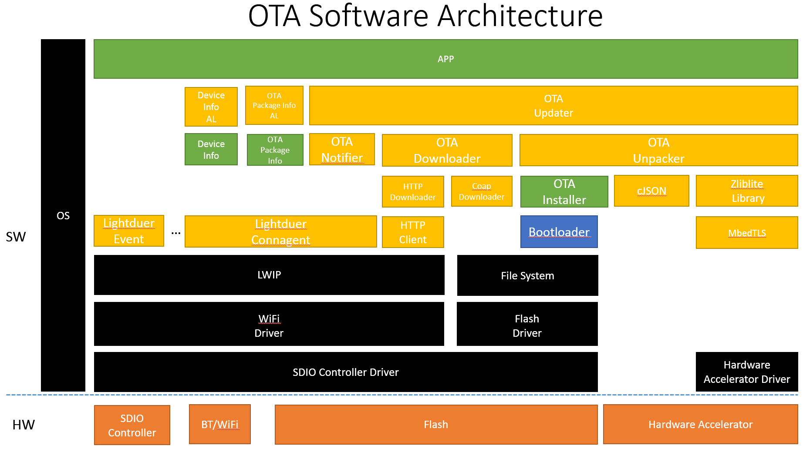

OTA Introduction
==================================================================================================

|               Author                 |          Change          | Version |    Date    |
| :-: | :-: | :-: | :-: |
| Zhong Shuai (zhongshuai@baidu.com)   |        Initialise        |  1.0.0  | 2017.11.30 |

--------------------------------------------------------------------------------------------------

1. OTA Software Architecture
2. OTA Modules
    1. Downloader
    2. OTA HTTP Downloader
    3. Unpacker
    4. Updater
    5. Notifier
    6. Installer
    7. Zliblite
3. Updating Package
    1. Updating Package Structure
    2. Build Updating Package
4. OTA Useage
    1. Preparation
    2. Initialize OTA
5. Demo Code

--------------------------------------------------------------------------------------------------

1. OTA Software Architecture


--------------------------------------------------------------------------------------------------

2. OTA Modules
    1. Downloader
       Downloader is a abstraction layer to support a wide variety of download protocol.
        1. OTA HTTP Downloader
           OTA HTTP Downloader is a downloader to support HTTP protocol.

    2. Unpacker
        1. Unpacker module is used to unpack a updating package which packed by Duer Cloud.
        2. Unpacker module provide APIs which use to parse updating package.
        3. Unpacker module provide decompression & verification APIs.

    3. Updater
       Updater is a manager who will call other OTA modules to install updating package.

    4. Notifier
       Notifier module is used to notify the Duer Cloud that the upgrade progress of the device

    5. Installer
       Installer module is a abstraction layer which you need to implement it by yourself.
       You need to implement OTA Installer and register it to the OTA Unpacker.
       After the OTA Unpacker unpack the updating package, you can get the original data &
       [configuration information] which you upload to the Duer Cloud.

    6. Zliblite
       Decompression Library
       The Unpacker modules is dependent on it.

--------------------------------------------------------------------------------------------------

3. Updating Package
    1. Updating Package Structure

```

                                              0                                     31  Bit
                                    ---       ----------------------------------------
                                    |    Tag  | M         B            E           D |
                                    |         ----------------------------------------
                                    |         |             Header Size              |
                                    |         ----------------------------------------
                                    |         |       Package Signature Size         |
                                    |         ----------------------------------------
                                    |         |     Package Signature (128 Byte)     |
                                    |         |             ......                   |
                   Package Header <=          ----------------------------------------
                                    |         |        Meta Signature Size           |
                                    |         ----------------------------------------
                                    |         |       Meta Signature (128 Byte)      |
                                    |         |             ......                   |
                                    |         ----------------------------------------
                                    |         |             Meta Size                |
                                    |         ----------------------------------------
                                    |         |       Original Package Size          |
            ---                      ---      ----------------------------------------
            |                       |         |             APP Name                 |
            |                       |         |               ......                 |
            |                       |         ----------------------------------------
            |     Meta Basic Info <=          |            Update Flag               |
            |                       |         |               ......                 |
            |                       |         ----------------------------------------
            |                       |         |            Package Type              |
            |                       |         |               ......                 |
            |                        ---      ----------------------------------------
            |                                 |        Package Install Path          |
            |                                 |               ......                 |
            |                        ---      ----------------------------------------
            |                       |         |            Module_1 Name             |
            |                       |         |               ......                 |
            |                       |         ----------------------------------------
            |                       |         |            Module_1 Type             |
            |                       |         |               ......                 |
            |                       |         ----------------------------------------
            |                       |         |            Module_1 Size             |
            |                       |         |               ......                 |
            |                       |         ----------------------------------------
            |                       |         |            Module_1 Update Flag      |
            |                       |         |               ......                 |
            |                       |         ----------------------------------------
            |                       |         |            Module_1 Signature        |
            |                       |         |               ......                 |
            |                       |         ----------------------------------------
            |                       |         |            Module_1 Version          |
            |                       |         |               ......                 |
            |                       |         ----------------------------------------
            |                       |         |       Module_1 Hardware Version      |
            |                       |         |               ......                 |
            |    Module List Info <=          ----------------------------------------
            |                       |         |            Module_2 Name             |
            |                       |         |               ......                 |
            |                       |         ----------------------------------------
Meta Data <=                        |         |            Module_2 Type             |
            |                       |         |               ......                 |
            |                       |         ----------------------------------------
            |                       |         |            Module_2 Size             |
            |                       |         |               ......                 |
            |                       |         ----------------------------------------
            |                       |         |            Module_2 Update Flag      |
            |                       |         |               ......                 |
            |                       |         ----------------------------------------
            |                       |         |            Module_2 Signature        |
            |                       |         |               ......                 |
            |                       |         ----------------------------------------
            |                       |         |            Module_2 Version          |
            |                       |         |               ......                 |
            |                       |         ----------------------------------------
            |                       |         |       Module_2 Hardware Version      |
            |                       |         |               ......                 |
            |                       |         ----------------------------------------
            |                       |         |                Module_3              |
            |                       |         |                ......                |
            |                       |          ---------------------------------------
            |                       |         |                Module_4              |
            |                       |         |                ......                |
            |                        ---      ----------------------------------------
            |                                 |            Update Information        |
            |                                 |                ......                |
            |                                 ----------------------------------------
            |                                 |                 Feature              |
            |                                 |                  ......              |
             ---         ---                  ----------------------------------------
                        |                     |             Module_1 Data            |
                        |                     |                 ......               |
                        |                     ----------------------------------------
                        |                     |             Module_2 Data            |
                        |                     |                 ......               |
          Module Data <=                      ----------------------------------------
                        |                     |             Module_3 Data            |
                        |                     |                 ......               |
                        |                     ----------------------------------------
                        |                     |             Module_4 Data            |
                        |                     |                 ......               |
                         ---                  ----------------------------------------
```

    2. Build Updating Package
       If you have only one bin file, just upload it to the Duer Cloud. The Duer Cloud will
       build the updating package for you automatically.
       If you have multiple bin files, and you have specific needs and want to configure
       the updating package manually, contact me.

-----------------------------------------------------------------------------------------------

4. OTA Useage
    1. Preparation
        1. Dependence
            1. The OTA HTTP Downloader depend on HTTP Client module, so Enable it.
               modules_module_HTTP=y
               Now HTTP downloader adapt LWIP, so link it. You can adapt to other network protocol
               stacks.
            2. The OTA Unpacker depend on Zliblite so Enable it.
               external_module_Zliblite=y
            3. The Zliblite depend on MbedTLS, so Enable it.
               external_module_mbedtls=y (If you use your own MbedTLS lib, Disable it)
            4. OTA Notifier depend on lightduer connagent.
               module_framework=y
               modules_module_coap=y
               modules_module_connagent=y
            5. OTA Unpack depend on cJSON
               modules_module_cjson=y
            6. The OTA depend on device info module
               modules_module_Device_Info=y

        2. Enable OTA
           Copy the following text to the configuration file(sdkconfig.mk)
           modules_module_OTA=y

    2. Initialize OTA
        1. Implement duer_ota_init_ops_t (See lightduer_ota_updater.h Line:64)
           Call duer_init_ota() to init OTA module after CA(lightduer connagent) start.

        2. Implement duer_ota_installer_t (See lightduer_ota_installer.h Line:79)

        3. Register duer_ota_installer_t
           Call duer_ota_unpack_register_installer() to register OTA installer.

        4. Implement duer_package_info_ops_t
           Call duer_ota_register_package_info_ops() to register the information of updating
           package.

        5. Implement struct DevInfoOps
           Call duer_register_device_info_ops() to register the information of device.

        6. Report Device information
           You have to call duer_report_device_info() to report the information of device to the
           Duer Cloud after CA start.

        7. Report OTA package information
           After the reboot of system you have to call duer_ota_notify_package_info() to report the
           information of OTA package to the Duer Cloud after CA start.

--------------------------------------------------------------------------------------------------

5. Demo code
```
#include "lightduer_types.h"
#include "lightduer_dev_info.h"
#include "lightduer_ota_unpack.h"
#include "lightduer_ota_updater.h"
#include "lightduer_ota_notifier.h"
#include "lightduer_ota_installer.h"

#define FIRMWARE_VERSION "1.0.0.0"
#define CHIP_VERSION     "esp32"
#define SDK_VERSION      "1.0"

struct OTAInstallHandle {
    duer_ota_updater_t *updater;
    esp_ota_handle_t update_handle;
    const esp_partition_t *update_partition;
};

static duer_package_info_t s_package_info = {
    .product = "ESP32 Demo",
    .batch   = "12",
    .os_info = {
        .os_name        = "FreeRTOS",
        .developer      = "Allen",
        .os_version     = "1.0.0.0", // This version is that you write in the Duer Cloud
        .staged_version = "1.0.0.0", // This version is that you write in the Duer Cloud
    }
};

static int ota_notify_data_begin(void *ctx)
{
    esp_err_t err;
    int ret = DUER_OK;
    struct OTAInstallHandle *pdata = NULL;
    const esp_partition_t *update_partition = NULL;
    esp_ota_handle_t update_handle = 0 ;

    if (ctx == NULL) {
        DUER_LOGE("OTA Unpack OPS: Argument Error");

        ret = DUER_ERR_INVALID_PARAMETER;

        goto out;
    }

    pdata = (struct OTAInstallHandle *)ctx;

    update_partition = esp_ota_get_next_update_partition(NULL);
    if (update_partition != NULL) {
        DUER_LOGI("OTA Unpack OPS: Writing to partition subtype %d at offset 0x%x",
             update_partition->subtype, update_partition->address);
    } else {
        DUER_LOGE("OTA Unpack OPS: Get update partition failed");

        ret = DUER_ERR_FAILED;

        goto out;
    }

    err = esp_ota_begin(update_partition, OTA_SIZE_UNKNOWN, &update_handle);
    if (err != ESP_OK) {
        DUER_LOGE("Init OTA failed, error = %d", err);

        ret = DUER_ERR_FAILED;

        goto out;
    }

    pdata->update_partition = update_partition;
    pdata->update_handle = update_handle;
out:
    return ret;
}

static int ota_notify_meta_data(void *cxt, duer_ota_package_meta_data_t *meta)
{
    return DUER_OK;
}

static int ota_notify_module_data(
        void *cxt,
        unsigned int offset,
        unsigned char *data,
        unsigned int size)
{
    esp_err_t err;
    int ret = DUER_OK;
    esp_ota_handle_t update_handle = 0 ;
    struct OTAInstallHandle *pdata = NULL;

    if (cxt == NULL) {
        DUER_LOGE("OTA Unpack OPS: Argument Error");

        ret = DUER_ERR_FAILED;

        goto out;
    }

    pdata = (struct OTAInstallHandle *)cxt;
    update_handle = pdata->update_handle;

    err = esp_ota_write(update_handle, (const void *)data, size);
    if (err != ESP_OK) {
        DUER_LOGE("OTA Unpack OPS: Write OTA data failed! err: 0x%x", err);

        ret = DUER_ERR_FAILED;
    }
out:
    return ret;
}

static int ota_notify_data_end(void *ctx)
{
    esp_err_t err;
    int ret = DUER_OK;
    esp_ota_handle_t update_handle = 0 ;
    const esp_partition_t *update_partition = NULL;
    struct OTAInstallHandle *pdata = NULL;

    if (ctx == NULL) {
        DUER_LOGE("OTA Unpack OPS: Argument Error");

        ret = DUER_ERR_INVALID_PARAMETER;

        goto out;
    }

    pdata = (struct OTAInstallHandle *)ctx;
    update_handle = pdata->update_handle;
    update_partition = pdata->update_partition;

    err = esp_ota_end(update_handle);
    if (err != ESP_OK) {
        DUER_LOGE("OTA Unpack OPS: End OTA failed! err: %d", err);

        ret = DUER_ERR_FAILED;

        goto out;
    }

    err = esp_ota_set_boot_partition(update_partition);
    if (err != ESP_OK) {
        DUER_LOGE("OTA Unpack OPS: Set boot partition failed! err = 0x%x", err);

        ret = DUER_ERR_FAILED;

        goto out;
    }
out:
    return ret;
}

static int ota_update_img_begin(void *ctx)
{
    int ret = DUER_OK;

    DUER_LOGI("OTA Unpack OPS: update image begin");

    return ret;

}

static int ota_update_img(void *ctx)
{
    int ret = DUER_OK;

    DUER_LOGI("OTA Unpack OPS: updating image");

    return ret ;
}

static int ota_update_img_end(void *ctx)
{
    int ret = DUER_OK;

    DUER_LOGI("OTA Unpack OPS: update image end");

    return ret;
}

// See lightduer_ota_installer.h Line:79
static duer_ota_installer ota_installer = {
    .notify_data_begin  = ota_notify_data_begin,
    .notify_meta_data   = ota_notify_meta_data,
    .notify_module_data = ota_notify_module_data,
    .notify_data_end    = ota_notify_data_end,
    .update_img_begin   = ota_update_img_begin,
    .update_img         = ota_update_img,
    .update_img_end     = ota_update_img_end,
};

static int duer_ota_init_updater(duer_ota_updater_t *ota_updater)
{
    int ret = DUER_OK;
    struct OTAInstallHandle *ota_install_handle = NULL;

    ota_install_handle = (struct OTAInstallHandle *)malloc(sizeof(*ota_install_handle));
    if (ota_install_handle == NULL) {

        DUER_LOGE("OTA Unpack OPS: Malloc failed");

        ret = DUER_ERR_MEMORY_OVERLOW;

        goto out;
    }

    ota_install_handle->updater = ota_updater;

    ret = duer_ota_unpack_register_installer(ota_updater->unpacker, &ota_installer);
    if (ret != DUER_OK) {
        DUER_LOGE("OTA Unpack OPS: Register installer failed ret:%d", ret);

        goto out;
    }

    ret = duer_ota_unpack_set_private_data(ota_updater->unpacker, ota_install_handle);
    if (ret != DUER_OK) {
        DUER_LOGE("OTA Unpack OPS: Set private data failed ret:%d", ret);
    }
out:
    return ret;
}

static int duer_ota_uninit_updater(duer_ota_updater_t *ota_updater)
{
    struct OTAInstallHandle *ota_install_handle = NULL;

    ota_install_handle = duer_ota_unpack_get_private_data(ota_updater->unpacker);
    if (ota_install_handle == NULL) {
        DUER_LOGE("OTA Unpack OPS: Get private data failed");

        return DUER_ERR_INVALID_PARAMETER;
    }

    free(ota_install_handle);

    return DUER_OK;
}

static int reboot(void *arg)
{
    int ret = DUER_OK;

    DUER_LOGE("OTA Unpack OPS: Prepare to restart system");

    esp_restart();

    return ret;
}

static int get_package_info(duer_package_info_t *info)
{
    int ret = DUER_OK;
    char firmware_version[FIRMWARE_VERSION_LEN + 1];

    if (info == NULL) {
        DUER_LOGE("Argument Error");

        ret = DUER_ERR_INVALID_PARAMETER;

        goto out;
    }

    memset(firmware_version, 0, sizeof(firmware_version));

    ret = duer_get_firmware_version(firmware_version);
    if (ret != DUER_OK) {
        DUER_LOGE("Get firmware version failed");

        goto out;
    }

    strncpy((char *)&s_package_info.os_info.os_version,
            firmware_version,
            FIRMWARE_VERSION_LEN + 1);
    memcpy(info, &s_package_info, sizeof(*info));

out:
    return ret;
}

// See lightduer_ota_notifier.h Line: 74
static duer_package_info_ops_t s_package_info_ops = {
    .get_package_info = get_package_info,
};

// See lightduer_ota_updater.h Line: 64
static duer_ota_init_ops_t s_ota_init_ops = {
    .init_updater = duer_ota_init_updater,
    .uninit_updater = duer_ota_uninit_updater,
    .reboot = reboot,
};

static int get_firmware_version(char *firmware_version)
{

    strncpy(firmware_version, FIRMWARE_VERSION, FIRMWARE_VERSION_LEN);

    return DUER_OK;
}

static int get_chip_version(char *chip_version)
{
    strncpy(chip_version, CHIP_VERSION, CHIP_VERSION_LEN);

    return DUER_OK;
}

static int get_sdk_version(char *sdk_version)
{
    strncpy(sdk_version, SDK_VERSION, SDK_VERSION_LEN);

    return DUER_OK;
}

static int get_network_info(struct NetworkInfo *info)
{
    info->network_type = WIFI;

    strncpy(info->mac_address, "00:0c:29:f6:c8:24", MAC_ADDRESS_LEN);
    strncpy(info->wifi_ssid, "test", WIFI_SSID_LEN);

    return DUER_OK;
}

// See lightduer_dev_info.h Line: 55
static struct DevInfoOps dev_info_ops = {
    .get_firmware_version = get_firmware_version,
    .get_chip_version     = get_chip_version,
    .get_sdk_version      = get_sdk_version,
    .get_network_info     = get_network_info,
};

int duer_initialize_ota(void)
{
    int ret = DUER_OK;

    ret = duer_init_ota(&s_ota_init_ops);
    if (ret != DUER_OK) {
        DUER_LOGE("Init OTA failed");
    }

    ret = duer_ota_register_package_info_ops(&s_package_info_ops);
    if (ret != DUER_OK) {
        DUER_LOGE("Register OTA package info ops failed");
    }

    return ret;
}

static void duer_event_hook(duer_event_t *event)
{
    switch (event->_event) {
    case DUER_EVENT_STARTED:

        ret = duer_report_device_info();
        if (ret != DUER_OK) {
            DUER_LOGE("Report device info failed ret:%d", ret);
        }

        duer_initialize_ota();

        ret = duer_ota_notify_package_info();
        if (ret != DUER_OK) {
            DUER_LOGE("Report package info failed ret:%d", ret);
        }

        break;

    case DUER_EVENT_STOPPED:
        break;
    }
}

int main(void)
{
    int ret = DUER_OK;

    // ......

    duer_initialize();

    duer_set_event_callback(duer_event_hook);

    // ......

    ret = duer_register_device_info_ops(&dev_info_ops);
    if (ret != DUER_OK) {
        DUER_LOGE("Dev Info: Register dev ops failed");

        goto out;
    }

    // ......

out:
    return ret;
}
```
